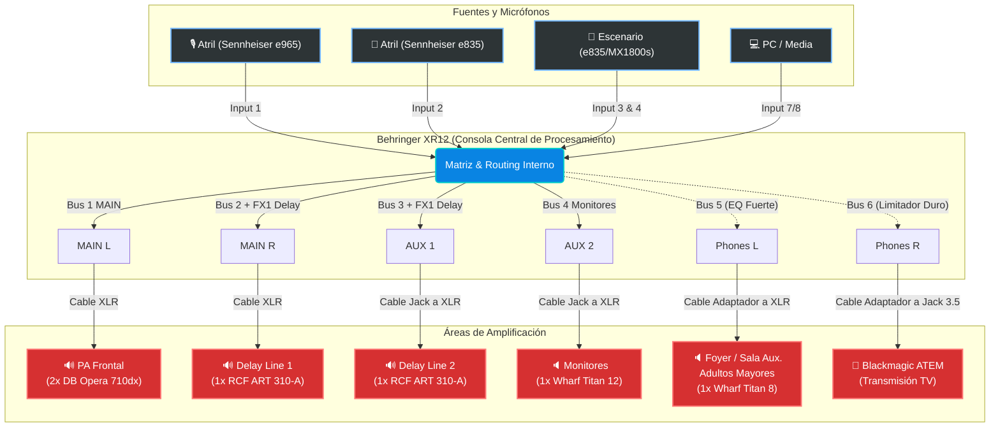

# Instalación Básica de Audio (Sistema XR12 Multizona)

Este documento detalla el conexionado físico y el diagrama de flujo de señal para el evento, utilizando el equipamiento listado en el `inventario.md` y respetando la arquitectura del sistema Behringer XR12 descrita en las configuraciones previas.

## 1. Asignación de Entradas (Patch List)

| Canal | Fuente de Audio | Equipo / Micrófono | Cableado Sugerido |
|:---:|:---|:---|:---|
| **Ch 01** | Atril Principal (Condensador) | Sennheiser e965 | XLR M/H |
| **Ch 02** | Atril Secundario (Dinámico) | Sennheiser e835 | XLR M/H |
| **Ch 03** | Micrófono de Mano (Escenario)| Sennheiser e835 | XLR M/H |
| **Ch 04** | Micrófono de Mano (Escenario)| Behringer MX1800s | XLR M/H |
| **Ch 07/08**| Multimedia L / R | Salida de PC / Media Player | Cable 3.5mm a 1/4" TS (R/L) |

> [!TIP]
> **X-AIR Automix:** Los canales 01 y 02 (Atril) están asignados al grupo Automix (X) para suprimir ruidos de fondo cuando no se habla. Los demás micrófonos de escenario tienen el Automix desactivado para evitar cortes involuntarios.

## 2. Asignación de Salidas y Parlantes (Routing Multizona)

Aprovechando el ruteo avanzado de la XR12, utilizamos las 6 vías independientes de la siguiente forma:

| Salida en XR12 | Destino | Equipamiento Asignado (Del Stock) |
|:---|:---|:---|
| **MAIN L (XLR)** | PA Frontal | 2x DB Opera 710dx (Linkeados en serie vía XLR) |
| **MAIN R (XLR)** | Línea de Delay 1 | 1x RCF ART 310-A |
| **AUX 1 (TRS)** | Línea de Delay 2 | 1x RCF ART 310-A |
| **AUX 2 (TRS)** | Monitores de Escenario | 1x Wharfedale Titan 12 |
| **PHONES (L)** | Sala Auxiliar (Soporte Mayor) | 1x Wharfedale Titan 8 |
| **PHONES (R)** | Transmisión TV / Broadcast | Entrada Mic del Blackmagic ATEM Mini Pro |

> [!WARNING]
> La salida de auriculares (`PHONES`) es un puerto TRS Estéreo de 1/4". Se requiere un **cable insert (Y-Splitter)** que separe la punta (L - Bus 5) y el anillo (R - Bus 6) hacia dos conectores mono (TS) para alimentar la sala auxiliar y el switcher de video respectivamente.

## 3. Diagrama de Conexiones Mapeado

El siguiente diagrama muestra el flujo explícito de la señal desde los micrófonos, pasando por los nodos de procesamiento interno de la XR12, hasta finalizar en los altoparlantes:

## 4. Notas de Procedimiento Logístico

1. **Cálculo de Delays:** Las medidas físicas (metros de distancia) para los *Delay Line 1* y *2* deben medirse en el salón en relación al PA. Dichos valores serán convertidos a Milisegundos e introducidos en la XR12 (Configuración Dual Pitch - FX1).
2. **Niveles de Operación Seguros:** El Bus 6 lleva un limitador duro de señal. Es necesario configurar la ganancia de entrada de micrófono del Blackmagic ATEM Mini al 50% y empujar los faders desde la XR12 para prevenir cualquier clip o distorsión remota.
3. **Logística de Cableado:** Hay 68 cables disponibles. Se recomienda reservar inmediatamente los dos cables XLR extra-largos de **50m** y los dos de **28m** exclusivamente para conectar la lejanía del PA Principal y el Front Delay Line 1 antes de usar cables empalmados.
